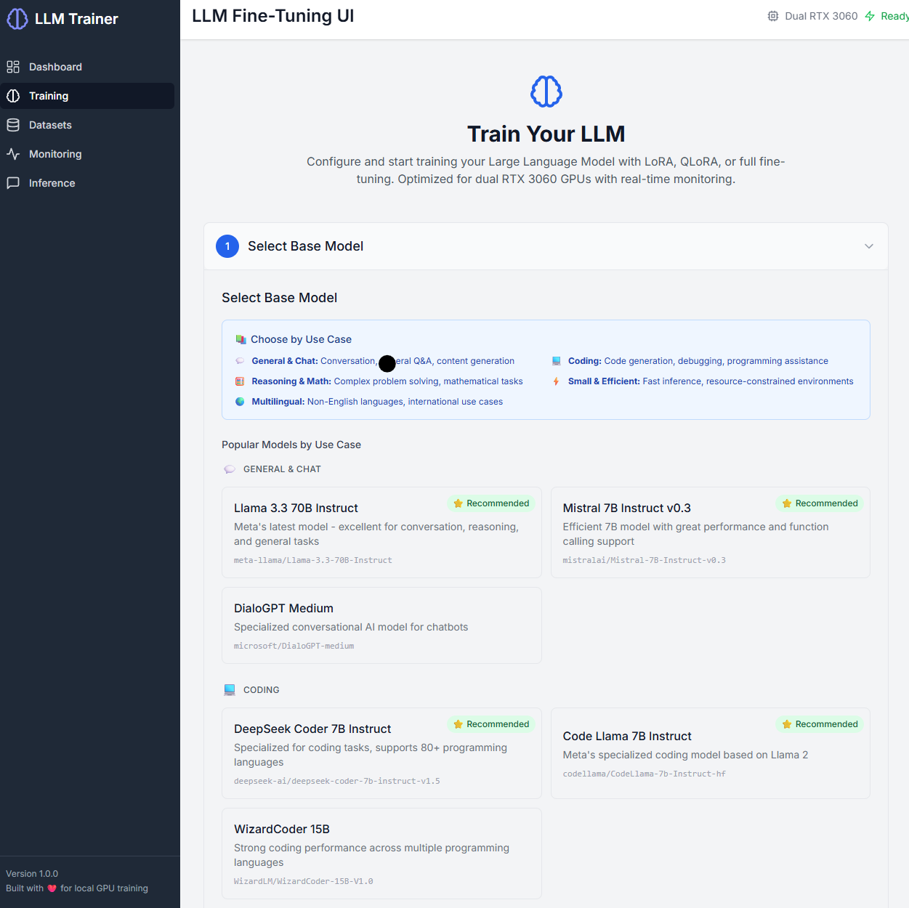
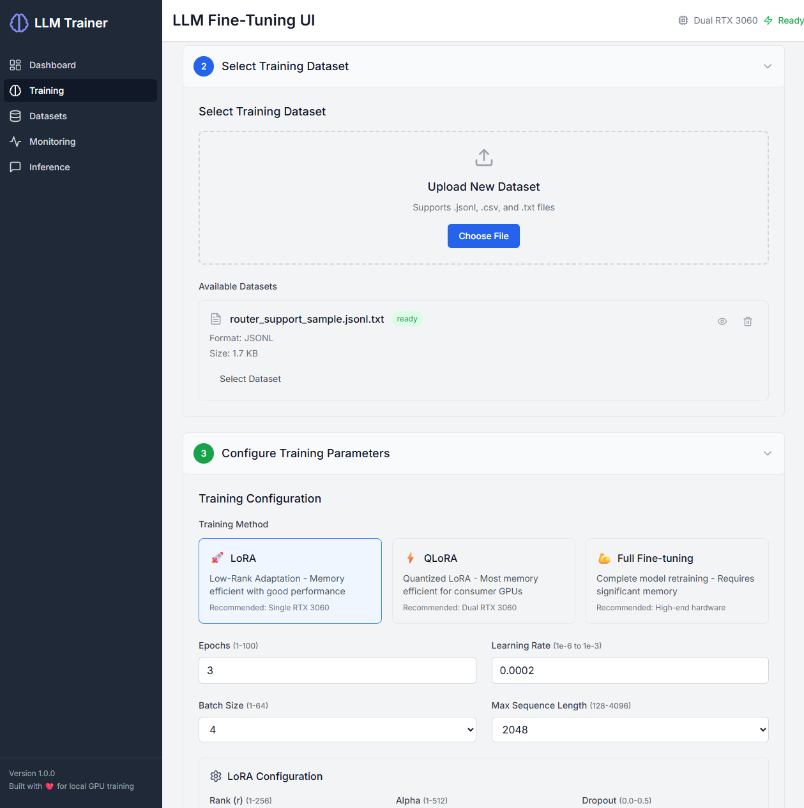
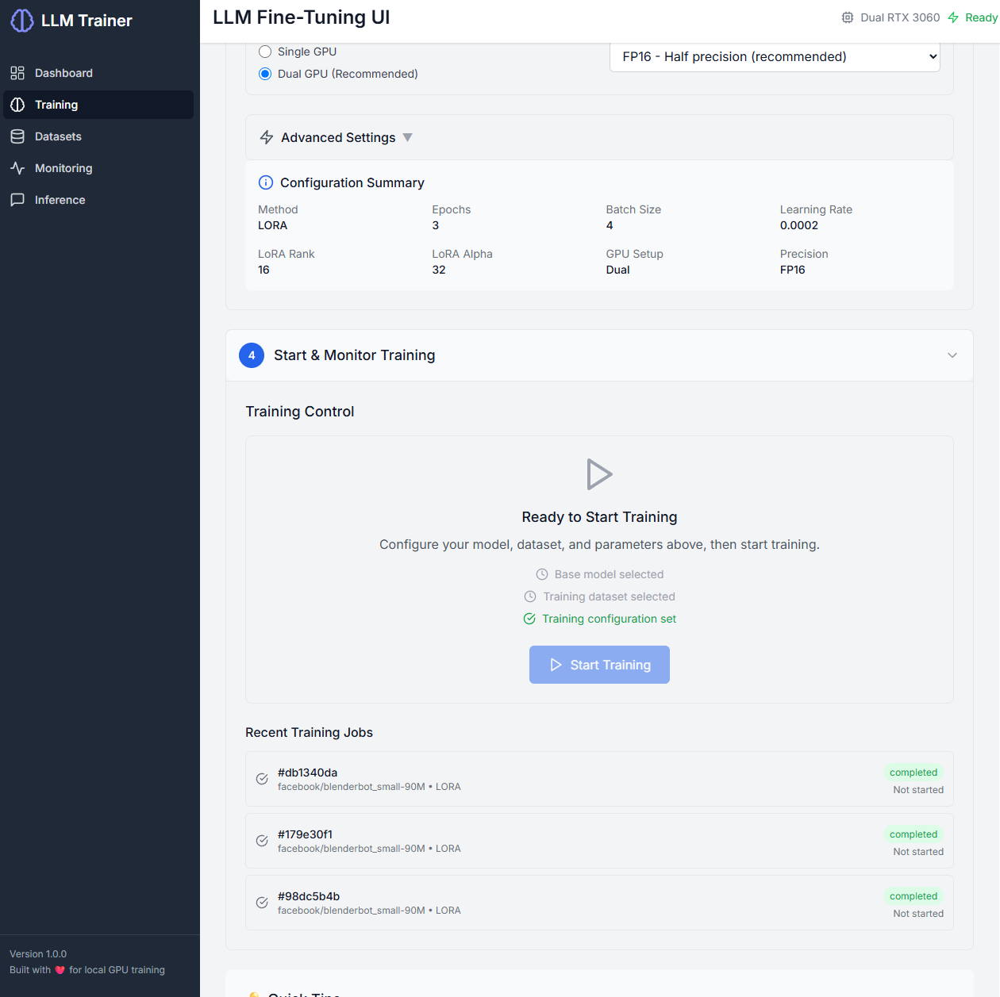

# LLM Fine-Tuning UI

A user-friendly web-based interface for training and fine-tuning Large Language Models (LLMs) on local consumer hardware. Built specifically for dual RTX 3060 GPUs with support for LoRA, QLoRA, and full fine-tuning techniques.



## 🚀 Features

### Core Functionality
- **Model Selection**: Support for popular Hugging Face models with organized categories (General Chat, Coding, Reasoning, etc.)
- **Dataset Management**: Upload and process datasets in JSONL, CSV, and TXT formats
- **Training Methods**: LoRA, QLoRA, and full fine-tuning support
- **Real-time Monitoring**: Live training logs, GPU statistics, and loss visualization
- **Checkpoint Management**: Save, resume, and manage training checkpoints
- **Inference Sandbox**: Test your fine-tuned models with an interactive interface

### Technical Highlights
- **Hardware Optimized**: Designed for dual RTX 3060 GPU setups
- **Memory Efficient**: QLoRA support for consumer GPU constraints
- **Fast Iteration**: Sub-10 second feedback loop from configuration to training start
- **Resumable Training**: Automatic checkpoint saving every 500 steps
- **Background Processing**: Non-blocking UI during training operations

## 📸 Screenshots

### Model Selection with Use Case Categories
Choose from curated models organized by use case - General Chat, Coding, Reasoning & Math, Small & Efficient, and Multilingual support.


### Dataset Upload and Management
Upload your training data in multiple formats with real-time validation and preview capabilities.



### Training Control and Monitoring
Start, monitor, and control your training jobs with real-time feedback and comprehensive logging.



## 🛠 System Requirements

### Hardware
- **GPUs**: Dual RTX 3060 (12GB VRAM total) or equivalent
- **RAM**: 32GB+ recommended
- **Storage**: 100GB+ free space for models and checkpoints

### Software
- **OS**: Ubuntu Linux 20.04+ with CUDA 11.8+
- **Python**: 3.10 or higher
- **Node.js**: 18.0+ (for frontend development)

## 📦 Installation

### 1. Clone the Repository
```bash
git clone git@github.com:ddunford/LLMTune.git
cd LLMTune
```

### 2. Backend Setup
```bash
cd backend/
python -m venv venv
source venv/bin/activate
pip install -r requirements.txt
```

### 3. Frontend Setup
```bash
cd frontend/
npm install
```

### 4. Install Axolotl
```bash
pip install axolotl[flash-attn,deepspeed]
```

### 5. CUDA Configuration
Ensure CUDA is properly installed and accessible:
```bash
nvidia-smi  # Should show your GPUs
python -c "import torch; print(torch.cuda.is_available())"  # Should return True
```

## 🚀 Quick Start

### 1. Start the Backend
```bash
cd backend/
source venv/bin/activate
python main.py
```

### 2. Start the Frontend
```bash
cd frontend/
npm run dev
```

### 3. Access the UI
Open your browser and navigate to `http://localhost:3000`

## 📖 Usage Guide

### 1. Select Base Model
- Choose from curated models organized by use case:
  - **💬 General & Chat**: Conversation, Q&A, content generation (Llama 3.3, Mistral 7B)
  - **💻 Coding**: Programming assistance, code generation (DeepSeek Coder, Code Llama)
  - **🧮 Reasoning & Math**: Complex problem solving (DeepSeek Math, Phi-3)
  - **⚡ Small & Efficient**: Fast inference, resource-friendly (Phi-3 Mini, Gemma 2)
  - **🌍 Multilingual**: International language support (Qwen 2.5, BLOOM)
- Or enter a custom Hugging Face model ID
- Verify tokenizer compatibility

### 2. Upload Dataset
- Navigate to the Dataset Management section
- Upload your training data (.jsonl, .csv, or .txt)
- Preview and validate the dataset format

### 3. Configure Training
- Select training method (LoRA/QLoRA/Full)
- Adjust parameters:
  - Learning rate, epochs, batch size
  - LoRA rank, alpha, dropout (for LoRA/QLoRA)
  - GPU and precision settings

### 4. Monitor Training
- View real-time logs and metrics
- Monitor GPU utilization and temperature
- Track loss curves and training progress

### 5. Manage Checkpoints
- Browse completed training runs
- Load checkpoints for inference
- Resume interrupted training sessions

## 📋 Data Format Requirements

### Supported File Formats

The application accepts training data in three formats:

#### 1. JSONL (Recommended) - `.jsonl`
**JSON Lines format** following the Alpaca/Instruction structure. Each line must be a valid JSON object with:

**Required fields:**
- `instruction`: The task or question to be performed
- `input`: Additional context (can be empty string `""`)
- `output`: The expected response/answer

**Example:**
```jsonl
{"instruction": "What is machine learning?", "input": "", "output": "Machine learning is a subset of artificial intelligence that enables computers to learn and make decisions from data without being explicitly programmed for every task."}
{"instruction": "Translate the following text to French", "input": "Hello, how are you?", "output": "Bonjour, comment allez-vous?"}
{"instruction": "Explain neural networks", "input": "", "output": "Neural networks are computing systems inspired by biological neural networks. They consist of interconnected nodes (neurons) that process information and learn patterns from data."}
```

#### 2. CSV - `.csv`
**Comma-separated values** with column headers. You can specify which columns contain the instruction and response data during upload.

**Expected structure:**
```csv
instruction,input,output
"What is AI?","","Artificial intelligence is..."
"Explain deep learning","","Deep learning is a subset of machine learning..."
"Summarize this text","Climate change is a pressing issue...","Climate change poses significant challenges..."
```

#### 3. TXT - `.txt`
**Plain text format** where each line is treated as a separate training example. Best for simple completion tasks.

**Example:**
```txt
The capital of France is Paris.
Python is a programming language.
Machine learning requires data.
```

### Dataset Processing Features

- **Automatic Conversion**: All formats are automatically converted to Axolotl-compatible format
- **Metadata Extraction**: File size, row count, estimated token count
- **Sample Preview**: First 5 rows displayed for validation
- **Format Validation**: Real-time validation during upload
- **Column Detection**: Automatic detection of available columns in CSV files

### Sample Dataset

A sample dataset is included at `backend/uploads/sample_dataset.jsonl` demonstrating the correct JSONL format. Use this as a reference for structuring your training data.

### Best Practices

1. **Use JSONL format** for best compatibility and control
2. **Keep instructions clear and specific** 
3. **Ensure consistent formatting** across all examples
4. **Include diverse examples** to improve model generalization
5. **Validate data quality** using the preview feature before training

## 🏗 Project Structure

```
LLMTune/
├── backend/                 # FastAPI backend
│   ├── main.py             # Application entry point
│   ├── train_runner.py     # Training orchestration
│   ├── config_builder.py   # YAML config generation
│   ├── models/             # Data models and schemas
│   ├── routes/             # API endpoints
│   ├── services/           # Business logic
│   ├── uploads/            # User datasets
│   ├── logs/              # Training logs
│   └── checkpoints/       # Model checkpoints
├── frontend/               # React frontend
│   ├── src/
│   │   ├── components/    # UI components
│   │   ├── pages/         # Page components
│   │   ├── hooks/         # Custom React hooks
│   │   ├── services/      # API services
│   │   └── utils/         # Utility functions
│   └── public/           # Static assets
├── docs/                  # Documentation and screenshots
│   ├── train_models.png   # Model selection interface
│   ├── train_dataset.png  # Dataset upload interface
│   ├── train_start.png    # Training control interface
│   └── PRD.md            # Product Requirements Document
├── configs/              # Training configurations
├── .cursor/              # Cursor IDE rules
│   └── rules/           # Development guidelines
└── README.md           # This file
```

## 🔧 Development

### Phase 1: MVP Features
- [x] ~~Project setup and structure~~
- [x] ~~Dataset upload functionality~~
- [x] ~~Base model selection interface with use case categories~~
- [x] ~~LoRA training configuration~~
- [x] ~~Training launch via UI~~
- [x] ~~Real-time logs and GPU statistics~~

### Phase 2: Extended Features
- [x] ~~QLoRA and full fine-tune support~~
- [x] ~~Checkpoint management system~~
- [x] ~~Inference preview/sandbox~~
- [ ] Multi-user authentication

### Development Guidelines
- **Backend**: FastAPI with Axolotl integration
- **Frontend**: React with Tailwind CSS
- **API Design**: RESTful endpoints with WebSocket streaming
- **Testing**: Unit, integration, and hardware tests
- **Performance**: Optimize for dual RTX 3060 constraints

### Running Tests
```bash
# Backend tests
cd backend/
pytest

# Frontend tests
cd frontend/
npm test
```

## 🤝 Contributing

1. Fork the repository
2. Create a feature branch (`git checkout -b feature/amazing-feature`)
3. Follow the development guidelines in `.cursor/rules/`
4. Commit your changes (`git commit -m 'Add amazing feature'`)
5. Push to the branch (`git push origin feature/amazing-feature`)
6. Open a Pull Request

### Code Style
- **Python**: Follow PEP 8, use Black formatter
- **JavaScript**: ESLint + Prettier configuration
- **Documentation**: Update README and docstrings

## 📄 License

This project is licensed under the MIT License - see the [LICENSE](LICENSE) file for details.

## 🆘 Support

### Common Issues
- **CUDA not detected**: Ensure NVIDIA drivers and CUDA toolkit are properly installed
- **Out of memory**: Try reducing batch size or using QLoRA instead of LoRA
- **Training stuck**: Check logs for dataset formatting issues

### Getting Help
- Check the [Issues](https://github.com/ddunford/LLMTune/issues) for common problems
- Review the [PRD.md](docs/PRD.md) for detailed specifications
- Consult the development guidelines in `.cursor/rules/`

## 🙏 Acknowledgments

- [Axolotl](https://github.com/OpenAccess-AI-Collective/axolotl) for the training backend
- [Hugging Face](https://huggingface.co/) for model and dataset ecosystem
- [LoRA](https://arxiv.org/abs/2106.09685) and [QLoRA](https://arxiv.org/abs/2305.14314) research papers

---

**Note**: This project is optimized for dual RTX 3060 GPUs but can be adapted for other hardware configurations. See the [PRD](docs/PRD.md) for detailed hardware requirements and optimization strategies. 